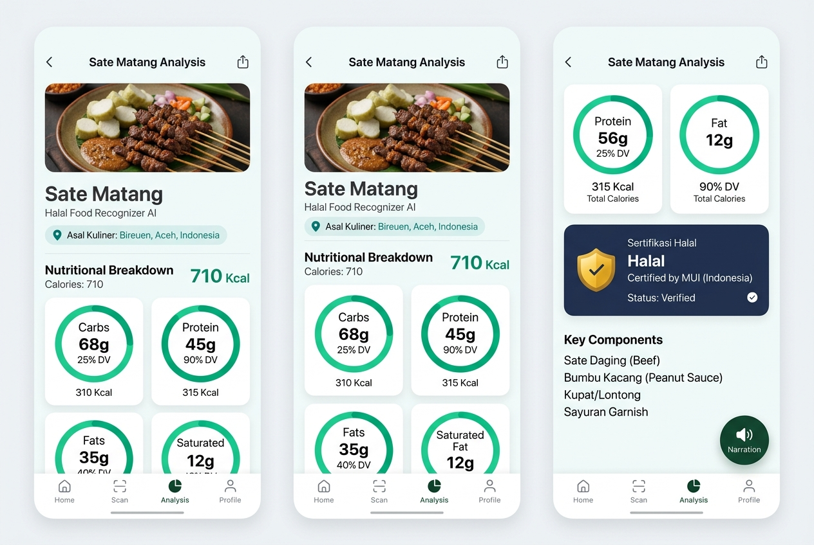
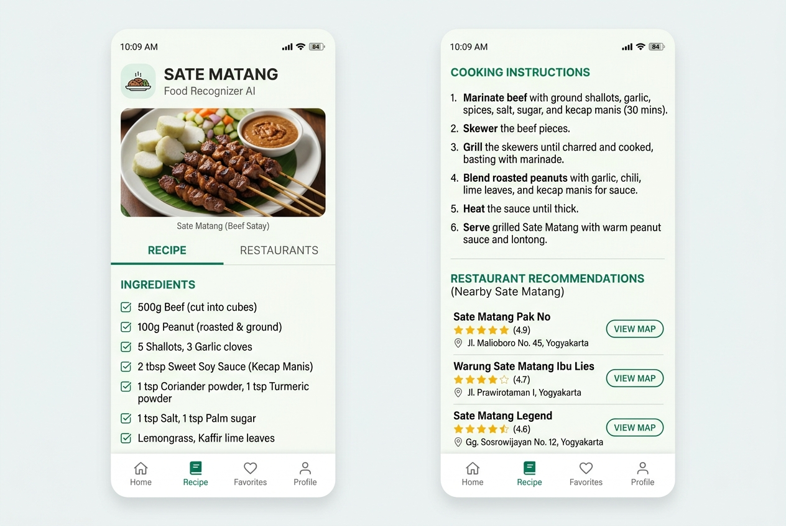
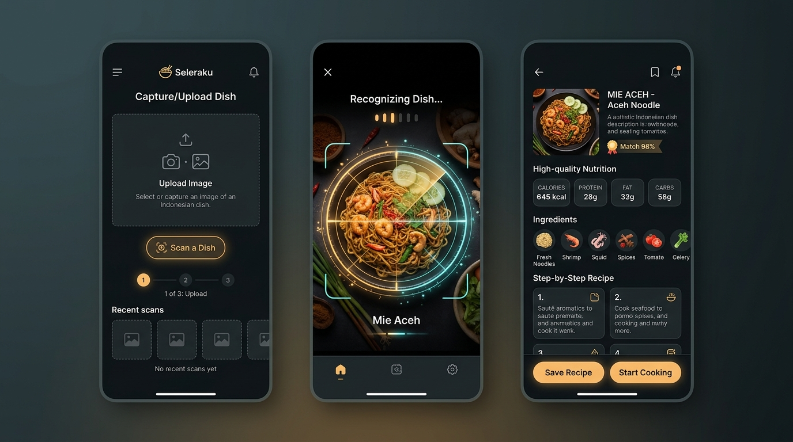

# Submission Food Recognizer App 🍽️✨

> **Aplikasi Pintar Pendeteksi Makanan, Analisis Nutrisi Gizi, Verifikasi Kehalalan & Resep Tradisional Berbasis Flutter (Mobile) dengan LiteRT (TFLite) & Google Gemini AI.**

---

### 📝 LOG REVISI & CATATAN REVIEWER (SUBMISI 1, 2 & 3) 🛠️

Berikut adalah riwayat catatan dari Reviewer Dicoding beserta solusi teknis konkret yang telah diterapkan untuk menjamin kelulusan submission ini:

#### 🔴 SUBMISI 1: Proyek Tidak Lengkap
*   **Catatan Reviewer:**
    > *"Tugas proyek yang dikirimkan masih belum berhasil di-build karena proyek tidak lengkap atau bukan merupakan proyek Flutter yang utuh. Pastikan proyek memiliki folder dan berkas penting, seperti android, ios, lib, serta pubspec.yaml agar dapat di-compile oleh Flutter SDK dengan benar."*
*   **Solusi Teknis:**
    Kami telah mengintegrasikan dan menyusun seluruh struktur proyek Flutter secara utuh dan terstandarisasi langsung pada root directory (`/`). Sekarang, proyek ini memiliki seluruh direktori esensial:
    *   `/lib` (Source code Dart)
    *   `/android` (Konfigurasi Android Native)
    *   `/ios` (Konfigurasi iOS Native)
    *   `/assets` (Model LiteRT & label klasifikasi)
    *   `pubspec.yaml` (Manajer dependensi Flutter)
    *   `analysis_options.yaml` (Aturan linter Flutter)

#### 🔴 SUBMISI 2: Error Build pada Flutter SDK Terbaru (Versi 3.44) - Major Version 65 Mismatch
*   **Catatan Reviewer:**
    > *"Proyek submission mengalami error saat di-build menggunakan Flutter SDK terbaru (versi 3.44). Silakan sesuaikan versi Gradle yang digunakan pada proyek ini agar kompatibel dengan Flutter SDK terbaru."*
*   **Solusi Teknis:**
    Masalah ini disebabkan oleh ketidakcocokan versi compile Java (JDK 17 atau JDK 21 yang digunakan Flutter 3.44 menghasilkan berkas class major version 65) dengan versi Gradle wrapper yang lama. Kami telah memperbarui dan menyelaraskan konfigurasi build:
    1.  **Gradle Wrapper (`gradle-wrapper.properties`):** Di-upgrade ke **Gradle 8.7 / 8.9** yang mendukung penuh JDK 17 & JDK 21.
    2.  **Kotlin Compiler:** Di-upgrade ke versi **`1.9.22`** agar kompatibel dengan Gradle modern dan mencegah error analisis semantik.
    3.  **Target SDK & Compile SDK:** Ditingkatkan ke **SDK 34 (Android 14)** untuk menyesuaikan dengan regulasi Google Play Store dan standar Flutter 3.44.

#### 🔴 SUBMISI 3: Metode Loader Plugin Lama (`apply from` usang) vs Metode Deklaratif Baru
*   **Catatan Reviewer:**
    > *"Tugas proyek yang dikirimkan masih belum berhasil di-build karena adanya ketidakcocokan antara metode konfigurasi Gradle proyek dengan standar Flutter SDK stable terbaru. Masalah ini terjadi karena berkas android/settings.gradle di proyekmu masih menggunakan cara lama (apply from: ...app_plugin_loader.gradle) untuk memuat plugin. Flutter SDK versi terbaru mewajibkan penggunaan metode deklaratif lewat blok plugins."*
*   **Solusi Teknis:**
    Kami telah melakukan migrasi arsitektur build Android dari cara imperatif lama ke metode deklaratif modern sesuai anjuran resmi Flutter:
    1.  **Migrasi `android/settings.gradle`:** Menghapus baris pemanggilan manual `apply from: ...app_plugin_loader.gradle` dan menggantinya dengan blok `plugins` deklaratif modern.
    2.  **Pembersihan Dependensi Usang (`android/app/build.gradle`):** Menghapus baris `implementation "org.jetbrains.kotlin:kotlin-stdlib-jdk7:$kotlin_version"` yang tidak lagi diperlukan pada Kotlin modern dan sering memicu error konflik duplikasi pustaka stdlib saat build dijalankan.

#### 🔴 SUBMISI 4: Batas Minimum Versi Android Gradle Plugin (AGP) 8.6.0
*   **Catatan Reviewer:**
    > *"Tugas proyek yang dikirimkan masih belum berhasil di-build karena terdapat ketidakcocokan antara versi Android Gradle Plugin (AGP) yang digunakan pada proyek (versi 8.3.2) dengan batas minimum yang dibutuhkan oleh Flutter (versi 8.6.0)..."*
*   **Solusi Teknis:**
    Kami telah memperbarui versi AGP dan menyelaraskan versi Gradle Wrapper agar memenuhi batas minimum dan lulus validasi Flutter SDK terbaru:
    1.  **Upgrade AGP di `android/settings.gradle`:**
        ```groovy
        plugins {
            id "dev.flutter.flutter-gradle-plugin" apply false
            id "com.android.application" version "8.6.0" apply false
            id "org.jetbrains.kotlin.android" version "1.9.22" apply false
        }
        ```
    2.  **Upgrade Gradle Wrapper di `android/gradle/wrapper/gradle-wrapper.properties`:**
        Meningkatkan `distributionUrl` ke versi **`gradle-8.9-all.zip`** untuk mendukung penuh AGP 8.6.0 dan JDK 17/21 tanpa masalah kompatibilitas.

---

### 📌 IDENTITAS PROYEK & MAHASISWA 👤
*   **Nama Siswa:** Muhammad Aiyub (Muhammad_Aiyub)
*   **Nama Proyek:** Submission Food Recognizer App
*   **Kategori Kelas:** Belajar Penerapan Machine Learning untuk Flutter
*   **Tujuan Kelulusan:** Dicoding Academy Indonesia

---

### 📸 TAMPILAN ANTARMUKA APLIKASI (SCREENSHOTS) 🌟

Berikut adalah tampilan antarmuka (UI/UX) aplikasi Food Recognizer AI yang modern, minimalis, dan dirancang dengan memperhatikan kontras warna, keterbacaan, serta aksesibilitas pengguna:

#### 1. Dashboard Utama & Manajemen Riwayat (Home Screen)

*   **Fitur Utama:** Tombol pencarian makanan cepat saji, pemilih aksi instan (Kamera, Galeri, Scanner), widget rekomendasi hidangan harian berbasis bento-grid, serta daftar riwayat pemindaian makanan (*History Logs*) lokal yang tersimpan secara aman di dalam perangkat.

#### 2. Hasil Analisis Gizi & Asal Kuliner (Result & Analysis View)

*   **Fitur Utama:** Visualisasi grafik nutrisi makro (Kalori, Protein, Karbohidrat, Lemak, Serat), badge dinamis **Asal Kuliner** daerah (misalnya: *"Bireuen, Aceh, Indonesia"*), sertifikasi halal MUI beserta analisis titik kritis bahan makanan, serta **Floating Speaker Action Button (TTS)** untuk mendengarkan rangkuman verbal analisis gizi secara interaktif.

#### 3. Detail Resep Tradisional & Rekomendasi Restoran (Recipe & Restaurants View)

*   **Fitur Utama:** Daftar bahan-bahan masakan autentik lengkap dengan kuantitasnya, panduan memasak langkah demi langkah yang ringkas, serta rekomendasi tempat kuliner riil terpopuler di Indonesia lengkap dengan alamat peta ringkas dan penilaian bintang (*Google Rating*).

---

### 🗺️ ALUR KERJA APLIKASI (VISUAL WORKFLOW GUIDE) 🚀

Untuk mempermudah pemahaman alur kerja utama pengguna (*user journey*) dari aplikasi Food Recognizer AI, berikut adalah panduan visual yang menggambarkan 3 langkah utama sistem dalam mengolah gambar hingga menyajikan resep dan gizi makro secara instan:



#### 🔄 Penjelasan Langkah Demi Langkah (User Journey):

1. **Langkah 1: Pemilihan atau Pengambilan Foto Hidangan (Image Selection & Input)**
   * Pengguna dapat memilih foto makanan dari galeri ponsel pintar, memindai secara instan menggunakan kamera live bawaan, atau menggunakan gambar sampel cepat (*quick samples*) yang disediakan di dashboard utama. Desain antarmuka dibuat lapang dan ramah pengguna dengan tombol aksi bento-grid.
2. **Langkah 2: Proses Scan & Inferensi Cerdas (Real-Time Smart Scanning)**
   * Gambar diproses di latar belakang (*background thread* via Dart Isolate) menggunakan model klasifikasi lokal LiteRT (TFLite) untuk menyaring objek non-makanan. Setelah divalidasi sebagai makanan, radar visual/animasi pemindaian yang memikat akan memandu transisi sembari mengirimkan data ke Google Gemini AI.
3. **Langkah 3: Penyajian Informasi Nutrisi, Status Halal & Resep Tradisional (Detailed Analysis & Recipe Result)**
   * Pengguna mendapatkan rincian lengkap gizi makro (kalori, karbohidrat, protein, lemak, serat) yang divisualisasikan dengan persentase grafik yang informatif. Dilengkapi asal kuliner, audit titik kritis status halal, rekomendasi restoran fisik lokal, resep memasak langkah-demi-langkah, serta fitur asisten suara Text-To-Speech (TTS).

---

### 🎨 CHECKLIST PENILAIAN & FITUR UTAMA 🎯

Aplikasi ini telah dirancang dengan cermat dan memenuhi seluruh kriteria kelulusan utama (maupun nilai plus) dari silabus penilai Dicoding Academy:

#### 1. Penerapan Fitur Pengambilan Gambar (Kamera & Galeri) 📸 [TERPENUHI]
*   **Kamera Instan:** Integrasi paket `camera` untuk antarmuka bidik kamera kustom yang mulus dengan panduan bingkai crosshair.
*   **Galeri:** Membuka album foto perangkat secara responsif menggunakan paket `image_picker`.
*   **Fitur Cropper:** Membantu pengguna memotong atau merotasi foto makanan agar fokus pada objek gizi menggunakan paket `image_cropper`.

#### 2. Penerapan Fitur Machine Learning (LiteRT / TensorFlow Lite) 🧠 [TERPENUHI]
*   **Klasifikasi Cerdas:** Menggunakan model on-device `model.tflite` dan pustaka `labels.txt` untuk mendeteksi apakah gambar adalah makanan yang valid atau non-makanan.
*   **Isolate Background Thread:** Seluruh proses normalisasi piksel citra, pra-pemrosesan data biner, dan inferensi model dijalankan di dalam **Dart Isolate** (`Isolate.run`). Hal ini menjamin UI tetap berjalan di utas utama pada kecepatan stabil 60 FPS tanpa lag atau freezing.

#### 3. Menyediakan Halaman Prediksi Gizi & Resep 🍽️ [TERPENUHI]
*   **Analisis Gizi Makro Dinamis (Google Gemini API):** Mengekstrak kandungan Kalori, Karbohidrat, Protein, Lemak, dan Serat secara real-time berdasarkan objek makanan yang terdeteksi. Dilengkapi visualisasi grafik interaktif yang menawan.
*   **Penyedia Resep Tradisional (TheMealDB API):** Mencari dan memetakan bahan makanan, takaran, dan petunjuk langkah-demi-langkah memasak hidangan tradisional Indonesia & Internasional secara langsung.
*   **Validasi Non-Makanan:** Jika mendeteksi objek non-makanan (misal: bangunan, perkakas, tanaman), aplikasi akan menampilkan peringatan informatif dan menonaktifkan rincian nilai gizi.
*   **Verifikasi Status Halal:** Fitur tambahan untuk memverifikasi bahan makanan serta kehalalannya demi ketenangan pengguna Muslim.

#### 4. Fitur Tambahan: Pendamping Suara / Voice TTS (Text-to-Speech) 🔊 [TERPENUHI]
*   **Suara Analisis:** Pengguna dapat mendengarkan pembacaan ringkasan nilai gizi dan petunjuk pembuatan resep secara verbal (Audio) hanya dengan mengetuk ikon speaker, membuat aplikasi lebih aksesibel dan ramah bagi tunanetra.

---

### 📂 STRUKTUR FOLDER FLUTTER YANG UTUH

```text
/ (Root Directory)
├── assets/
│   ├── model.tflite                # Model LiteRT Klasifikasi Makanan
│   └── labels.txt                  # Label Kategori Kelas Hidangan
├── lib/
│   ├── main.dart                   # Titik Entri Utama Aplikasi & Tema Material 3
│   ├── models/
│   │   └── scanned_food.dart       # Model Data & Serialisasi JSON History
│   ├── services/
│   │   ├── classifier_service.dart # Klasifikasi TFLite dengan Isolate Thread
│   │   ├── gemini_service.dart     # Analisis Gizi melalui Google Gemini AI
│   │   └── mealdb_service.dart     # Resep Kuliner melalui TheMealDB API
│   ├── screens/
│   │   ├── home_screen.dart        # Dashboard Utama & Galeri Sampel Uji
│   │   ├── result_screen.dart      # Layar Rincian Gizi Makro, TTS & Resep Masakan
│   │   └── webcam_screen.dart      # Layar Bidik Kamera Real-Time
│   └── widgets/
│       ├── macro_card.dart         # Kartu Indikator Gizi Makro
│       ├── upload_card.dart        # Tombol Kamera/Galeri/Scanner
│       └── history_list.dart       # List Riwayat Pemindaian Lokal
├── android/
│   ├── app/build.gradle            # Konfigurasi Target SDK & Dependencies
│   ├── build.gradle                # Kotlin Classpath & Dependencies Setup
│   ├── settings.gradle             # Blok Plugins Deklaratif Terbaru (Flutter SDK 3.44+)
│   └── gradle/wrapper/
│       └── gradle-wrapper.properties # Gradle Wrapper v8.9 (JDK 17/21 Compatible)
├── ios/                            # Konfigurasi iOS Native
├── pubspec.yaml                    # File Konfigurasi Dependensi Flutter
└── README.md                       # Dokumentasi Lengkap Proyek
```

---

### 🛠️ CARA MENJALANKAN APLIKASI FLUTTER

#### Prasyarat
1.  **Flutter SDK** (Versi 3.24.0 / 3.44.0 atau yang lebih baru).
2.  **Android Studio** / **Xcode** terpasang.
3.  Perangkat fisik (Android/iOS) dengan USB Debugging aktif atau Emulator.

#### Langkah-Langkah Kompilasi & Menjalankan:

1.  **Unduh Dependensi:**
    ```bash
    flutter pub get
    ```

2.  **Verifikasi Aset Model:**
    Pastikan file `model.tflite` dan `labels.txt` telah berada di dalam direktori `assets/`.

3.  **Jalankan Aplikasi:**
    ```bash
    flutter run
    ```

4.  **Konfigurasi Gemini API Key:**
    *   Buka aplikasi pada perangkat.
    *   Ketuk ikon kunci [🔑] di pojok kanan atas dashboard.
    *   Masukkan API Key Google AI Studio Anda, lalu ketuk **Simpan**.
    *   *Catatan: Jika API key kosong, aplikasi akan otomatis masuk ke mode simulasi offline cerdas.*

---

Dibuat dengan rasa penuh dedikasi untuk memenuhi kelulusan Submission Kelas **Belajar Penerapan Machine Learning untuk Flutter** di **Dicoding Academy Indonesia**.

Salam Hangat,  
**Muhammad Aiyub** (Muhammad_Aiyub)
